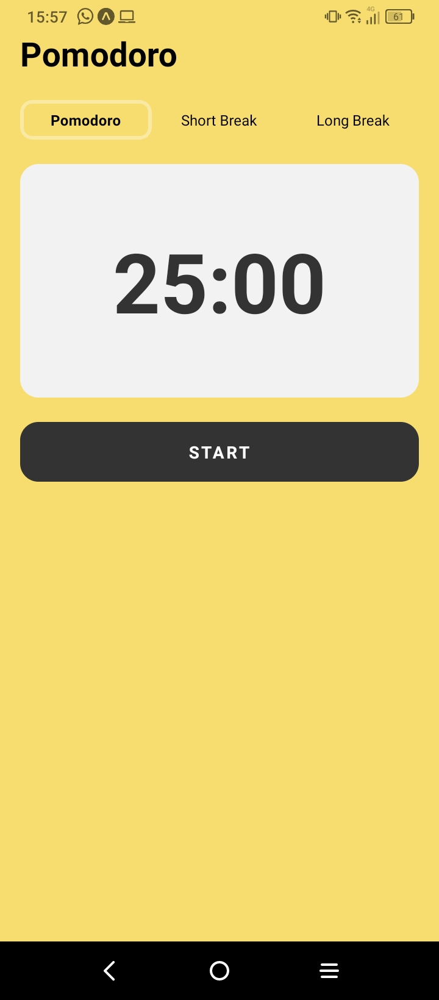
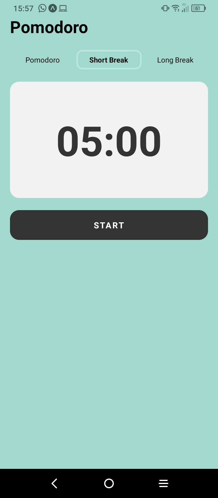
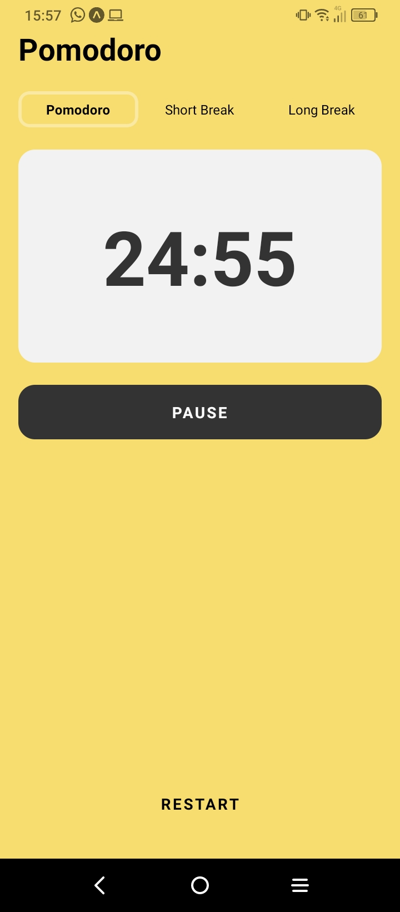

# 🍎 Pomodoro App en React Native

## Descripción
Esta aplicación de Pomodoro en React Native te ayuda a gestionar tu tiempo utilizando la técnica Pomodoro, que consiste en periodos de trabajo enfocado seguidos de cortos descansos.

## Capturas de Pantalla

### Pomodoro



### Short break


### Long break


### Worked



## Funcionalidades Principales
- **Temporizador Pomodoro**: Realiza sesiones de trabajo.
- **Descansos**: Intervalos de descanso entre las sesiones de trabajo.

## Requisitos Previos
Antes de comenzar, asegúrate de tener instalado [Node.js](https://nodejs.org/) y [Expo CLI](https://docs.expo.dev/get-started/installation/) en tu máquina.

## Instrucciones de Instalación

1. **Clona el Repositorio**
   ```bash
   git clone https://github.com/PabloChavez03/pomodoro-mobile.git

2. **Instala las dependecias**
   ```bash
    cd pomodoro-mobile
    npm install

3. **Inicia la aplicación**
   ```bash
    npm start


